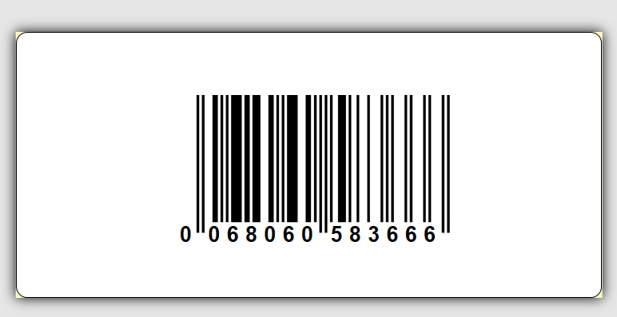
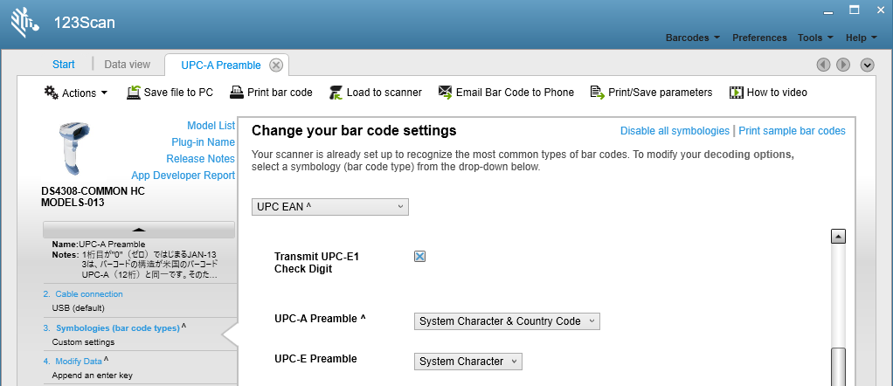
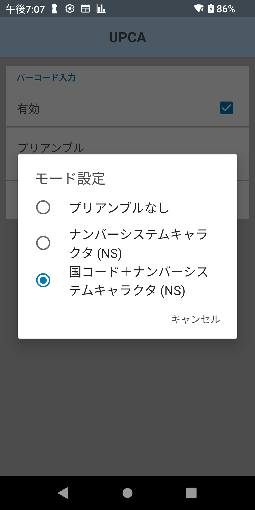

###Zebra-Scanner-Datawedge_Result 13digits by Scanning EAN13 Starts with 0 
# 1桁目が"0(ゼロ)"で始まるJAN-13を13桁で出力する方法

</br>

**1桁目が"0(ゼロ)"で始まるJAN-13をスキャンすると12桁で出力されてしまうことがあります。13桁で出力する場合は下記手順の通り設定します。**

</br>




</br>

### 解説
1桁目が"0"（ゼロ）ではじまるJAN-13は、バーコードの構造が米国のバーコードUPC-A（12桁）と同一です。そのため、バーコードリーダーはUPC-Aと判別し12桁で出力します。

</br>

## （123Scan）スキャナの設定

1. 123Scanを起動します。
1. Symbologies設定を変更します。
    ```
    - UPC EAN
     > UPC-A Premable = System Character and Country Code
    ```

    
    </br>

1. スキャナに設定を反映させます。
1. 動作確認をします。

    </br>
    </br>


## (DataWedge) Zebra Android端末の設定

1. Android端末のDataWedgeを開きます。
1. 任意のプロファイルを選択します。
1. 選択したプロファイルに対して下記設定をします。
    ```
    [バーコード入力]
    スキャナ設定 > デコーダー > UPCA
    > プリアンブル = "国コード+ナンバーシステムキャラクタ(NS)"
    ```

    
    </br>

1. 動作確認をします。

---
End